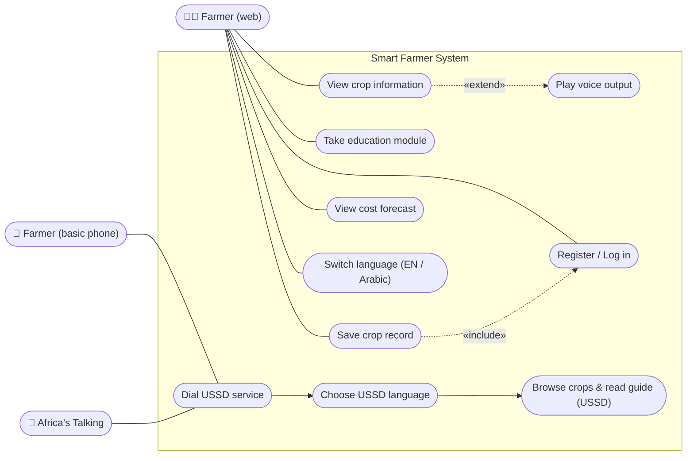
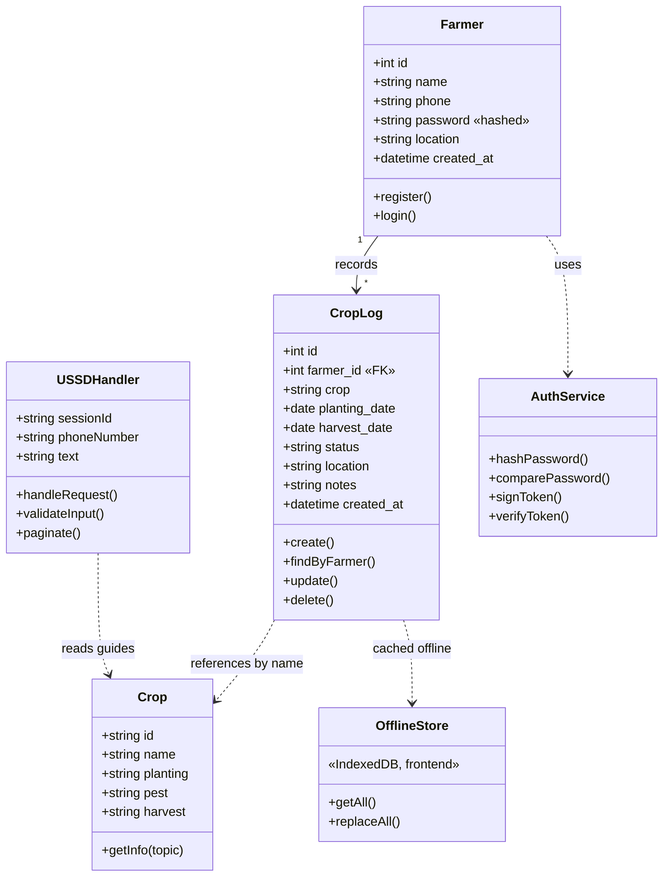
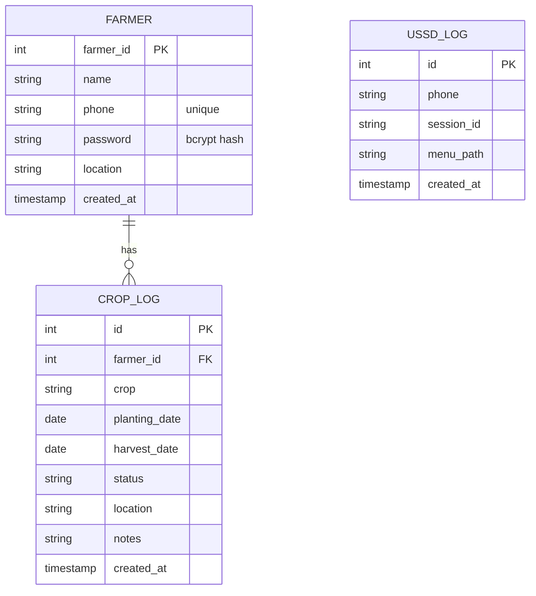
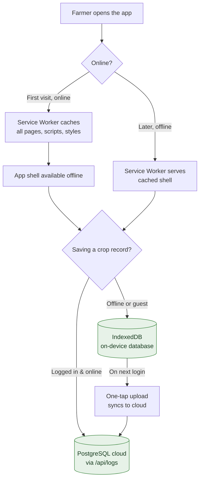

# Smart Farmer — System Diagrams

These diagrams reflect the **system as built**. They render automatically on
GitHub.

**Report-ready images:** high-resolution PNG versions of all four diagrams are
in [`docs/img/`](img/) (`1-use-case.png`, `2-class.png`, `3-erd.png`,
`4-offline-flow.png`) — drop these straight into the report. The editable
source for each is the matching `.mmd` file; to re-export, paste it into
<https://mermaid.live>.

---

## 1. Use Case Diagram

Who uses the system and what they can do. `«include»` means a use case always
performs another as a sub-step; `«extend»` means an optional added behaviour.

---

## 2. Class Diagram

The main classes of the built system, their data, and their behaviour.

---

## 3. Entity-Relationship Diagram (Database)

The PostgreSQL schema created by the backend on startup.

---

## 4. Offline Data-Flow (Frontend)

How the web app keeps working without a connection, and how records reach the
cloud. This addresses how offline functionality is handled on the frontend.

